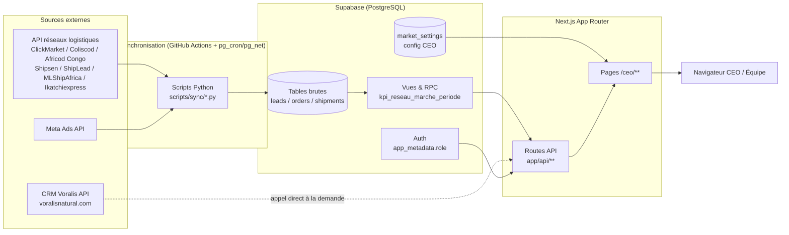

# SOP — Dashboard CEO Voralis

> Ce document décrit **comment le dashboard a été conçu** (contexte, règles métier, architecture technique) et **comment l'utiliser** (rôle par rôle, onglet par onglet).
> Pour le détail exact des formules de calcul et du stockage des données par onglet, voir le document complémentaire [reference-fonctionnelle-onglets.md](./reference-fonctionnelle-onglets.md).

---

## 1. Présentation

### 1.1 Contexte et problématique

Naturala Lda (FGMED) opère un modèle de vente en ligne où le client paie **en espèces à la livraison** (COD — Cash On Delivery), sur 10+ marchés (Angola, Gabon, Congo, Mali, Guinée, Sénégal, Côte d'Ivoire, Burkina Faso, Maroc, Cameroun, Argentine, Centrafrique). Ce modèle génère une chaîne complexe d'acteurs et de données :

- Des **campagnes publicitaires** (Meta Ads) génèrent des leads.
- Des **réseaux logistiques COD** (ClickMarket, Coliscod Angola, Africod Congo, Shipsen, ShipLead, MLShipAfrica, Ikatchiexpress) et des **affiliés marketing** (via le CRM Voralis) transforment ces leads en commandes : confirmation téléphonique, puis tentative de livraison, puis encaissement réel.
- Chaque marché a sa **propre devise locale** (AOA, XAF, XOF, GNF, MAD...) et son propre réseau logistique.
- L'argent réellement gagné dépend d'une chaîne de coûts (produit, transport, retours, publicité ou commission d'affilié) qui n'est visible qu'après livraison **et** encaissement.

**Le problème que ce dashboard résout** : avant sa mise en place, il n'existait aucune vue consolidée et fiable permettant de répondre à des questions simples mais critiques pour le pilotage de l'entreprise :

- Quelle est la marge nette réelle par marché, une fois tous les coûts déduits ?
- Où est le goulot d'étranglement qui empêche d'atteindre un volume de commandes rentables suffisant ?
- Quel est le niveau de trésorerie réel (encaissé, sorti) par pays ?
- Un budget publicitaire ou une grille de commission affilié est-il encore rentable, ou faut-il l'arrêter ?

Le dashboard a été conçu pour répondre à ces questions **sans jamais fabriquer un chiffre** : quand une donnée n'existe pas dans les sources connectées, l'application le signale explicitement plutôt que d'afficher un zéro ou une estimation invisible.

### 1.2 Objectif directeur unique

Toute la plateforme centralise les données nécessaires à une seule question :

> **Combien de commandes sont livrées ET encaissées ET rentables, chaque jour, par pays ?**

C'est aussi la métrique que le Copilot IA optimise en priorité (objectif : 50 commandes livrées, encaissées et rentables par jour, toutes zones confondues — voir §4.9).

### 1.3 Utilisateurs et rôles

L'application distingue deux rôles, appliqués **côté serveur** (jamais un simple masquage visuel dans le navigateur) :

| Rôle | Accès |
|---|---|
| **CEO** | Vue complète : marge nette, décomposition des coûts (COGS, ad spend, payout), marge plancher confidentielle, tous les paramètres de marché. |
| **Équipe (team)** | Vue opérationnelle : volumes, taux, plafonds d'action (ex. « CPL max à ne pas dépasser »), feu tricolore (🟢/🟠/🔴) — **jamais** la marge, les coûts ou la marge plancher, y compris via le Copilot IA. |

L'authentification repose sur Supabase Auth ; le rôle est stocké côté serveur et ne peut pas être falsifié depuis le navigateur (détail technique en §3.4).

### 1.4 Valeur apportée

- **Décision basée sur l'argent réel**, pas sur des indicateurs de façade (taux de confirmation).
- **Comparabilité multi-pays** sans jamais fausser les montants par une conversion automatique non maîtrisée.
- **Détection proactive des dérives de rentabilité** (CPL, payout) avant qu'elles n'érodent la marge sur un marché entier.
- **Gain de temps pour le CEO** grâce au Copilot IA, qui priorise l'action plutôt que de simplement afficher des chiffres.
- **Confidentialité respectée** : la marge et les coûts ne sont jamais exposés à l'équipe opérationnelle, y compris par l'assistant conversationnel.

---

## 2. Principes de conception (règles métier fondamentales)

Toute la plateforme est construite autour de règles non négociables, appliquées de façon identique sur chaque écran — les comprendre est nécessaire pour interpréter correctement n'importe quel chiffre affiché.

**Règle 1 — L'argent n'existe que sur commande livrée ET encaissée.** Une commande « confirmée » par téléphone n'est qu'une étape du tunnel de vente (funnel) : elle ne représente **aucun argent réel** tant qu'elle n'est pas livrée et payée. Aucun indicateur financier de l'application n'est calculé sur la base des confirmations.

**Règle 2 — Tous les KPI monétaires sont calculés sur la base « livré + encaissé ».** Chiffre d'affaires, marge, trésorerie : toujours au même stade du cycle de vie de la commande, jamais mélangé avec des indicateurs de funnel (leads, taux de confirmation), qui restent des indicateurs de diagnostic opérationnel.

**Règle 3 — Les devises ne sont jamais additionnées entre pays.** Chaque montant reste affiché dans sa devise locale réelle. Toute comparaison entre pays passe par un **taux de change modifiable manuellement par le CEO** (jamais une API de change automatique) — c'est le CEO qui décide du taux de référence utilisé pour le pilotage.

**Règle 4 — Les frais de livraison sont un forfait fixe de 13 USD par commande** (11 $ forfait de base + 2 $ de charge fixe, call center inclus), converti en devise locale via le taux de change du marché concerné. L'Angola fait exception : le canal interne « Field Cash » utilise le coût réel de sa propre flotte de livraison plutôt que ce forfait (voir §4.7).

**Règle 5 — `null` ≠ `0`.** Une donnée manquante ou non calculable s'affiche explicitement comme telle (badge « donnée manquante », tiret avec info-bulle) — jamais silencieusement remplacée par zéro, ce qui fausserait une marge ou un total sans que personne ne le remarque.

**Règle 6 — Aucune saisie manuelle de résultat.** Les seuls champs modifiables à la main par le CEO sont des paramètres de configuration (`market_settings` : taux de change, taux de référence, marge plancher...) — jamais un chiffre d'affaires, une marge ou un statut de commande, tous recalculés en direct depuis les sources connectées.

Trois limites structurelles assumées, signalées explicitement à l'écran plutôt que masquées : le délai avant le premier contact commercial n'est pas fourni par toutes les sources, les motifs d'annulation/retour ne sont pas catégorisés par les réseaux, et le chiffre d'affaires par affilié individuel n'est pas exposé par le CRM Voralis (marge affiliée structurellement incomplète, signalée comme telle sur l'écran concerné).

---

## 3. Architecture technique — comment le dashboard a été conçu

### 3.1 Stack technique

| Couche | Technologie | Version |
|---|---|---|
| Framework web | Next.js (App Router, Turbopack) | 16.2.7 |
| UI | React | 19.2.4 |
| Langage | TypeScript | ^5 |
| Style | Tailwind CSS | ^4 |
| Graphiques | Recharts | ^3.8.1 |
| Base de données / Auth | Supabase (PostgreSQL managé + Auth + Row Level Security) | `@supabase/supabase-js` ^2.106, `@supabase/ssr` ^0.12 |
| IA conversationnelle (Copilot) | OpenRouter (API compatible OpenAI), modèle `moonshotai/kimi-k3` | `openai` SDK ^6.45 (pointé sur OpenRouter) |
| Synchronisation des sources | Scripts Python (`scripts/sync/*.py`), déclenchés par GitHub Actions + `pg_cron`/`pg_net` (Supabase) | Python 3.12 |
| Tests unitaires | Vitest | ^4.1.9 |

**Particularité Next.js 16** : ce projet utilise une version dont plusieurs conventions diffèrent des versions précédentes de Next.js (ex. `middleware.ts` renommé `proxy.ts`, typage strict des routes générées dans `.next/types`) — une spécificité du framework à garder à l'esprit en lisant le code.

### 3.2 Schéma des flux de données



### 3.3 Principe directeur : séparation moteur métier / affichage

Le code applicatif suit systématiquement le même patron :

```text
Source de donnée (Supabase / API externe)
        │
        ▼
Module métier pur dans lib/*.ts (déterministe, testable unitairement)
        │
        ▼
Route API (app/api/**/route.ts) — applique le contrôle d'accès par rôle
        │
        ▼
Page "use client" (app/**/page.tsx) — fetch + affichage uniquement
```

Aucune logique de calcul de marge, de seuil ou d'agrégation n'est écrite directement dans un composant React : elle vit toujours dans `lib/`, ce qui permet de la tester indépendamment de l'interface. Les moteurs de calcul les plus critiques (chaîne marge → CPL max → payout max, classement des goulots d'étranglement) sont couverts par des tests unitaires purs (Vitest), sans accès réseau ni base de données.

Toutes les pages interactives sont des **Client Components**, car elles dépendent du filtre de date global (contexte React) et de requêtes déclenchées par l'utilisateur. Les calculs qui manipulent des données confidentielles (marge, coûts, seuils) sont en revanche **exclusivement exécutés côté serveur**, jamais dans un module importable par un composant client.

### 3.4 Contrôle d'accès par rôle (RBAC)

Le rôle (`"ceo"` ou `"team"`) est stocké dans **`app_metadata`** de l'utilisateur Supabase Auth — un espace modifiable uniquement via l'API d'administration (clé `service_role`), **jamais** dans `user_metadata`, qui reste modifiable par l'utilisateur lui-même et serait donc falsifiable.

```ts
// lib/auth/role.ts
export async function getCurrentUserRole(): Promise<"ceo" | "team" | null> {
  // lit la session Supabase authentifiée (cookie), jamais une valeur envoyée par le client
  // rôle absent/inconnu → "team" (fail-closed)
}
```

Chaque endpoint qui manipule une donnée confidentielle **calcule** la donnée complète puis **retire entièrement la clé correspondante de l'objet de réponse** avant sérialisation si le rôle n'est pas `"ceo"` — la donnée ne transite jamais vers le navigateur, elle n'est pas simplement cachée par une condition d'affichage :

```ts
// lib/thresholds.ts
export function stripCeoDetail(rows: ThresholdRow[]): Omit<ThresholdRow, "ceoDetail">[] {
  return rows.map((row) => {
    const rest: ThresholdRow = { ...row };
    delete rest.ceoDetail; // la clé n'existe plus dans l'objet renvoyé
    return rest;
  });
}
```

Ce même principe est appliqué au Copilot IA : pour le rôle `"team"`, le champ `margin` n'est **jamais calculé et transmis** au modèle de langage, qui ne peut donc ni l'inventer ni le déduire.

`proxy.ts` (le middleware Next.js 16) redirige en plus, au niveau du routage, tout utilisateur non autorisé hors des pages réservées au CEO — un confort d'expérience utilisateur, mais **la véritable barrière de sécurité est la vérification côté route API**, puisqu'un middleware peut en théorie être contourné par un appel direct à l'API.

### 3.5 Filtre de date global

**Mécanisme** : un seul sélecteur « De / À » (`Aujourd'hui · 7j · 30j · Mois en cours · Mois précédent · Personnalisé`, défaut 30 derniers jours) est partagé par tout le dashboard via un contexte React — `FilterProvider`/`useFilters()` (`lib/filters.tsx`). Il est monté **une seule fois** dans `app/layout.tsx` et rendu dans `Topbar` (`components/layout/DateRangeFilter.tsx`), présent en haut de chaque écran `/ceo/*` : il persiste donc sur toute navigation, sans être remonté par page ni réinitialisé quand on change d'onglet. Chaque page passe le même couple `dateFrom`/`dateTo` à ses requêtes.

**Pourquoi une seule colonne de date ne suffit pas** : la bonne colonne de date par KPI est appliquée dans les fonctions RPC Postgres elles-mêmes (pas dupliquée côté frontend, une seule source de vérité) — mais ce n'est **pas toujours la même colonne**, et c'est un choix de conception délibéré plutôt qu'une incohérence. La Règle 2 (§2) impose que l'argent soit compté sur la base « livré + encaissé », alors que le diagnostic de funnel (combien de leads sont entrés dans le tunnel de vente) n'a de sens que sur la date de **création** de la commande. Un seul filtre de dates appliqué aveuglément à toutes les tables donnerait donc soit un funnel tronqué (des leads créés en fin de période mais pas encore confirmés), soit un chiffre d'affaires tronqué (des commandes créées avant la période mais livrées dedans, ou l'inverse) — les deux ne peuvent pas être corrects simultanément avec une seule colonne.

**Les quatre familles de logique de date, telles qu'appliquées dans le code** :

| Famille | Colonne de référence | Écrans concernés |
|---|---|---|
| Funnel (leads, confirmées, en attente, annulées, doublons, rupture stock) | Date de **création** de la commande (`order_date` ou équivalent réseau) | Réseaux Logistiques, Seuils & plafonds (taux conf%/dr% observés), Copilot IA (volet funnel) |
| Financier « livré + encaissé » (CA, marge, trésorerie) | Date de **livraison** (`delivered_at`/`shipping_date`/`processed_at` selon le réseau) | Tableau de bord, Trésorerie, Rentabilité, Seuils & plafonds (AOV observé), Copilot IA (volet revenu) |
| Dépense publicitaire | Date de **dépense** réelle (`date`, `meta_ads_by_country`) | Media Buying Interne |
| État courant (snapshot, non filtré par date) | — | Stock & Inventaire (quantités), statut de rapatriement Field Cash Angola |

Le CRM Voralis (Affiliés externes) est un cas particulier : le payout est versé à la **confirmation**, pas à la livraison, alors que le chiffre d'affaires livré associé est lui bien basé sur la livraison — les deux logiques coexistent volontairement sur le même onglet, avec un rappel explicite à l'écran (§4.6).

**Piège concret à connaître** : une commande créée le 29 du mois et livrée le 2 du mois suivant apparaîtra dans le funnel de « ce mois-ci » (Réseaux Logistiques) mais dans le chiffre d'affaires de « le mois suivant » (Rentabilité/Trésorerie) une fois le même filtre appliqué aux deux écrans. Deux tableaux qui semblent porter sur « la même période » peuvent donc légitimement ne pas se recouper parfaitement — ce n'est pas un bug de synchronisation, c'est la conséquence directe de la Règle 2.

Le détail exact — colonne SQL précise, fenêtre de statut (`updated_at` vs date de livraison), particularités par réseau logistique — est documenté écran par écran, réseau par réseau, dans le [document de référence fonctionnelle](./reference-fonctionnelle-onglets.md) : c'est la source unique de vérité pour ce mapping, à consulter avant toute modification de requête liée aux dates.

### 3.6 Modules métier centraux (`lib/`)

| Fichier | Responsabilité |
|---|---|
| `lib/marketSettings.ts` | Constante du forfait de livraison, fonction unique `deliveryFeeLocal(fxToUsd)` réutilisée par tout le reste de l'application |
| `lib/margin.ts` | `computeBaseMargin()`, `computeL()`, `finalizeMargin()` — moteur de calcul de marge partagé par Rentabilité, Seuils et Copilot IA |
| `lib/thresholds.ts` | Calcul des plafonds CPL max / payout max par marché, agrégation serveur des réseaux logistiques + Meta Ads + CRM Voralis |
| `lib/countries.ts` | Normalisation pays ↔ devise ↔ drapeau, avec gestion des alias ISO (les sources externes ne codent pas les pays de façon uniforme) |
| `lib/inventory.ts` | Calcul du seuil de réapprovisionnement (jamais stocké, toujours recalculé) |
| `lib/affiliates.ts` | Traitement des données du CRM Voralis (leaderboard affiliés/pays) |
| `lib/treasury.ts` | Agrégation Trésorerie (cash encaissé, cash out) |
| `lib/copilot/snapshot.ts` | Agrégateur serveur unique, sensible au rôle, pour le Copilot IA et les alertes |
| `lib/copilot/bottleneck.ts` | Moteur déterministe de classement des goulots d'étranglement (aucun appel LLM) |
| `lib/copilot/alerts.ts` | Génération des alertes proactives par template (aucun appel LLM) |

Ces fonctions sont conçues comme **source unique de vérité** : une formule de marge ou de frais de livraison n'est jamais recodée localement dans un onglet, toujours réutilisée depuis `lib/`.

### 3.7 Intégrations externes

| Source | Rôle |
|---|---|
| Réseaux logistiques COD (ClickMarket, Coliscod, Africod Congo, Shipsen, ShipLead, MLShipAfrica, Ikatchiexpress) | Funnel complet (leads → confirmées → livrées), un schéma de synchronisation propre à chaque réseau mais des colonnes strictement identiques côté application |
| Meta Ads | Dépense publicitaire par pays/compte/jour |
| CRM Voralis (`voralisnatural.com`) | Performance des affiliés marketing externes (payout, commandes par affilié) |
| Copilot IA (OpenRouter) | Reformulation en langage naturel d'un résultat déjà calculé de façon déterministe — ne recalcule et n'invente jamais un chiffre |

### 3.8 Architecture du Copilot IA

Le module le plus avancé de la plateforme repose sur une architecture en couches conçue pour qu'un modèle de langage **ne puisse jamais inventer ou recalculer un chiffre** :

```text
1. lib/copilot/snapshot.ts
   Agrège toutes les sources existantes (funnel par réseau, marge, seuils, stock, trésorerie),
   sensible au rôle : les champs confidentiels ne sont même pas calculés pour le rôle "team".
        │
        ▼
2. lib/copilot/bottleneck.ts
   Moteur 100% déterministe qui classe les goulots d'étranglement par impact estimé
   vis-à-vis de l'objectif directeur (§1.2).
        │
        ▼
3a. app/api/copilot/chat/route.ts          3b. lib/copilot/alerts.ts
    Appel au LLM — le modèle reçoit le          Génération des alertes proactives
    résultat des étapes 1-2 et doit             par template (aucun appel LLM,
    répondre au format OÙ / QUOI / IMPACT,      coût et latence nuls).
    jamais un tableau de chiffres bruts.
```

**Choix technique notable** : les alertes proactives sont volontairement rendues sans appel au modèle de langage (template déterministe), tandis que le chat conversationnel appelle le LLM — un compromis coût/latence/utilité validé explicitement pour ce projet.

### 3.9 Structure des dossiers

```text
voralis-ceo/
├── app/
│   ├── ceo/                      # Toutes les pages du dashboard (Client Components)
│   │   ├── page.tsx              # Trésorerie
│   │   ├── dashboard/            # Tableau de bord
│   │   ├── profitability/        # Rentabilité
│   │   ├── thresholds/           # Seuils & plafonds
│   │   ├── meta-ads/             # Media Buying Interne
│   │   ├── logistics-cod/        # Réseaux Logistiques (hub, tous réseaux)
│   │   ├── crm-voralis/          # Affiliés externes
│   │   ├── inventory/            # Stock & Inventaire
│   │   ├── copilot/              # Copilot IA
│   │   ├── alerts/               # Alertes
│   │   ├── market-settings/      # Paramètres marché (CEO uniquement)
│   │   ├── team/                 # Performance des agents terrain
│   │   └── connections/          # Sources (santé du pipeline)
│   ├── api/                      # Routes API (contrôle d'accès + accès données)
│   └── login/
├── components/
│   ├── layout/                   # Sidebar, Topbar, DateRangeFilter
│   ├── kpi/                      # ProviderKpiTable (tableau partagé par les réseaux)
│   └── ui/                       # Composants génériques (Section, Badge, KpiCard...)
├── lib/
│   ├── copilot/                  # Moteurs du Copilot IA (snapshot, bottleneck, alerts)
│   ├── supabase/                 # Clients Supabase (browser, server/admin, requêtes)
│   ├── auth/                     # Résolution du rôle utilisateur
│   └── *.ts                      # Moteurs métier (margin, thresholds, marketSettings, ...)
├── supabase/                     # Scripts SQL (schémas + migrations)
├── scripts/sync/                 # Scripts Python de synchronisation des sources
└── proxy.ts                      # Middleware Next.js 16 (RBAC au niveau routage)
```

### 3.10 Choix d'architecture et justifications

| Décision | Justification |
|---|---|
| `NULL` ≠ `0` systématiquement | Un coût non renseigné ne doit jamais être traité comme un coût nul — sinon la marge affichée serait fausse sans que personne ne le sache |
| Devises jamais additionnées | Un total en « AOA + XAF » n'a aucun sens économique ; le CEO doit rester seul maître de la conversion |
| Moteur déterministe séparé du LLM (Copilot IA) | Empêche structurellement l'invention ou le recalcul erroné d'un chiffre par le modèle de langage — le LLM ne fait que mettre en forme |
| Gating par suppression de clé côté serveur, jamais par condition d'affichage | Une donnée qui n'est jamais sérialisée ne peut pas fuiter, même par une inspection réseau côté navigateur |
| Frais de livraison en constante centralisée (`deliveryFeeLocal()`) | Une seule fonction réutilisée partout évite qu'une évolution du montant ne soit appliquée de façon incohérente entre les écrans |
| Colonne de date propre à chaque KPI, appliquée côté SQL | Une seule source de vérité par KPI — aucun risque qu'une page applique la mauvaise date de référence |

---

## 4. Guide d'utilisation — les onglets

Ordre du menu latéral :

| # | Onglet | Rôle |
|---|---|---|
| 1 | Tableau de bord | Vue d'ensemble journalière (CA, marge nette réelle, commandes livrées), tous pays confondus |
| 2 | Trésorerie | Cash encaissé / cash out par pays (page d'accueil) |
| 3 | Rentabilité | Marge nette réelle par pays, poste par poste |
| 4 | Seuils & plafonds | Plafonds de CPL et de payout affilié, feu tricolore de décision |
| 5 | Media Buying Interne | Suivi des dépenses Meta Ads |
| 6 | Affiliés externes | Performance des affiliés du CRM Voralis |
| 7 | Réseaux Logistiques | Funnel détaillé des réseaux logistiques COD + Field Cash Angola |
| 8 | Stock & Inventaire | Stock de vente (Angola) + stock entrant (6 marchés) |
| 9 | Copilot IA | Assistant conversationnel de priorisation d'actions |
| 10 | Alertes | Alertes proactives (funnel, marge, stock, cash) |
| 11 | Équipe | Performance des agents terrain (Angola) |
| 12 | Sources | Santé du pipeline de données |
| 13 | Paramètres marché | Configuration CEO (taux de change, coûts, seuils) |

Toutes les pages (sauf mention contraire) partagent le même sélecteur de dates (§3.5), en haut de chaque écran.

### 4.1 Tableau de bord

**À utiliser pour** : un coup d'œil rapide, tous pays confondus, sur la tendance générale — trois courbes jour par jour (CA livré encaissé, marge nette réelle, commandes livrées), plus un comparatif par pays et le podium des meilleurs affiliés.

La courbe de marge affichée ici est la **vraie marge nette**, calculée jour par jour — pas une approximation (« marge simplifiée ») ni un simple total de période. Chaque point du jour J = CA livré du jour − ad spend Meta Ads du jour − payout affilié réel du jour (interrogé directement auprès du CRM Voralis pour ce jour précis) − COGS du jour (quantité expédiée × coût unitaire). Le tout est sommé en USD tous pays confondus pour cette vue d'ensemble, contrairement à Rentabilité (§4.3) qui reste toujours en devise locale par pays (Règle 3, §2). Un jour où le CRM Voralis est injoignable apparaît comme un **trou dans la courbe**, jamais comme un 0 qui fausserait la marge. Réservé au rôle CEO : un utilisateur au rôle équipe voit un message « réservé au CEO » à la place de cette courbe.

### 4.2 Trésorerie (page d'accueil)

**À utiliser pour** : savoir combien de cash a réellement été encaissé, et combien est sorti, pays par pays. Deux blocs : « Cash encaissé par pays » (chiffre d'affaires livré moins frais de livraison) et « Cash Out par pays » (ad spend + payout affilié + COGS + frais logistiques). Page en lecture seule.

### 4.3 Rentabilité

**À utiliser pour** : la marge nette réelle par pays, décomposée poste par poste (CA livré, frais de livraison, ad spend, payout affiliés, COGS, charges externes, profit par commande livrée). C'est l'écran de référence pour toute décision « ce marché est-il rentable ? » — le total réseau (toutes affiliations confondues) sert de référence unique, et les deux coûts d'acquisition (ad spend et payout affiliés) sont déduits ensemble, quel que soit le canal réel d'origine de la commande.

### 4.4 Seuils & plafonds

**À utiliser pour** : arbitrer en temps réel une campagne publicitaire ou un partenariat affilié, sans exposer la marge à l'équipe. Donne, par pays, le CPL maximum (coût par lead) et le payout affilié maximum au-delà desquels une commande devient non rentable, avec un feu tricolore (🟢 scale / 🟠 surveiller / 🔴 stop). En vue CEO, le détail du calcul (AOV, marge, marge plancher) est visible ; en vue équipe, seuls les plafonds actionnables et la couleur le sont.

### 4.5 Media Buying Interne

**À utiliser pour** : suivre la dépense publicitaire Meta Ads par pays puis par compte publicitaire (spend, clics, impressions, leads, CPL, CTR), filtrable par période.

### 4.6 Affiliés externes

**À utiliser pour** : évaluer chaque affilié et chaque pays sur une base « livré + rentabilité », jamais sur le seul taux de confirmation (indicateur de diagnostic, pas décisionnel). Un badge signale un coût de payout par commande confirmée jugé élevé.

### 4.7 Réseaux Logistiques

**À utiliser pour** : le détail du funnel (leads → confirmées → livrées → CA livré) réseau par réseau, avec des colonnes strictement identiques pour permettre une comparaison directe. Un onglet dédié « Field Cash Angola » couvre la logistique interne propre à l'Angola (flotte de livraison directement gérée, hors réseau externe), avec son propre suivi de cash collecté, frais réels et rapatriement.

### 4.8 Stock & Inventaire

**À utiliser pour** : deux vues à ne pas confondre — le stock côté vente en Angola (lu en direct depuis le CRM Voralis), et le stock entrant (expéditions fournisseur → warehouse, pas encore vendues) pour les 6 autres marchés, un tableau par réseau logistique.

### 4.9 Copilot IA

**À utiliser pour** : poser une question en langage naturel sur où agir en priorité. L'assistant analyse tout le tunnel de vente (acquisition → confirmation → livraison → encaissement) pour identifier le goulot d'étranglement le plus impactant vis-à-vis de l'objectif directeur (§1.2), et répond toujours au format **OÙ** (marché/réseau concerné) / **QUOI** (action concrète) / **IMPACT** (gain estimé) — jamais un simple tableau de chiffres. Respecte le même contrôle d'accès par rôle que le reste de l'application : le rôle équipe ne reçoit jamais la marge, même reformulée.

### 4.10 Alertes

**À utiliser pour** : un centre d'alertes proactives, calculées en direct (rien n'est stocké), qui signale automatiquement les risques de rupture de stock, les dépassements de seuils CPL/payout, les baisses de taux de livraison et le cash non rapatrié au-delà d'un seuil configurable par le CEO. À consulter en début de journée pour prioriser les vérifications.

### 4.11 Équipe

**À utiliser pour** : suivre la performance des agents terrain (livreurs) — limité à l'Angola, seul marché où cette donnée existe (flotte interne Field Cash). Pour les 6 autres marchés (prestataires logistiques externes), aucun détail par livreur individuel n'est disponible, la page l'indique explicitement plutôt que d'inventer un chiffre.

### 4.12 Sources

**À utiliser pour** : vérifier la santé du pipeline de données en direct — statut de chaque source connectée (🟢 connecté, 🟠 aucune donnée, 🔴 erreur), à chaque chargement de page. Utile en cas de chiffre qui semble incohérent sur un autre onglet : premier réflexe, vérifier ici que la source correspondante est bien à jour.

### 4.13 Paramètres marché

**À utiliser pour** : le seul écran de configuration du dashboard, réservé au CEO — un tableau éditable, une ligne par pays. Champs modifiables : taux de change vers USD, taux de confirmation/livraison de référence, AOV simulé (optionnel), marge plancher confidentielle. Le pays, la devise locale et le modèle de livraison (forfait standard ou coût réel Angola) sont verrouillés, non éditables.

---

## 5. Constantes métier à connaître

Quelques chiffres fixes, utiles pour interpréter n'importe quel écran du dashboard sans avoir à rouvrir le code :

| Constante | Valeur | Usage |
|---|---|---|
| Forfait de livraison | 13 $/commande livrée (11 $ base + 2 $ charge fixe, call center inclus) | 6 marchés externes — l'Angola utilise son coût réel (Field Cash) |
| COGS (coût de revient) | 15 $/unité expédiée (7 $ production + 8 $ transport fournisseur→warehouse) | Par unité physiquement expédiée, pas par commande livrée |
| Plafond de payout affilié | 9 $ par commande confirmée | Seuil de référence pour le feu tricolore Seuils & plafonds |
| Objectif directeur du Copilot IA | 50 commandes livrées, encaissées et rentables par jour | Toutes zones confondues |
| Seuil d'alerte payout affilié « coût élevé » | 10 $ par commande confirmée | Onglet Affiliés externes |

---

## 6. Historique des versions

| Version | Date | Auteur | Changements |
|---|---|---|---|
| 1.0 | 2026-08-07 | Claude (assistant) + revue utilisateur | Première version — SOP fonctionnel/technique (onglets, formules, stockage des données) |
| 2.0 | 2026-08-07 | Claude (assistant) + revue utilisateur | Refonte selon un gabarit de gouvernance (architecture, accès, déploiement, sécurité, incidents, support) ; contenu fonctionnel déplacé vers `reference-fonctionnelle-onglets.md` |
| 3.0 | 2026-08-07 | Claude (assistant) + revue utilisateur | Retour à un document conception + usage uniquement (contenu de gouvernance retiré) ; fusion et mise à jour du contenu de `description-fonctionnelle-dashboard.md` et `documentation-technique-dashboard.md` (désormais supprimés) |
